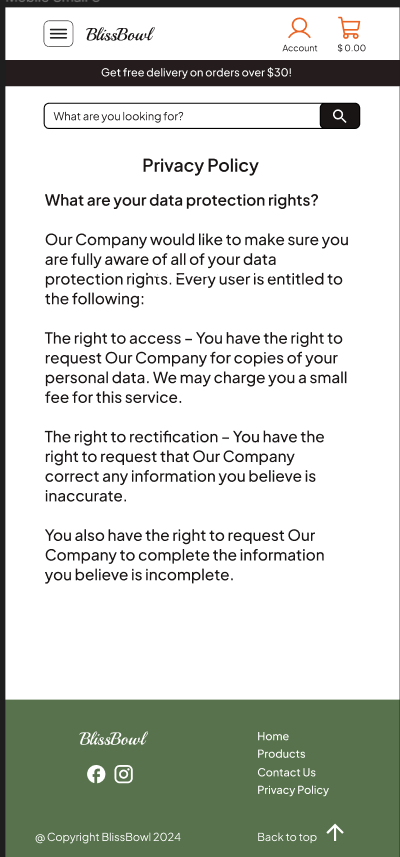

# BlissBowl Website

The BlissBowl Website represents a comprehensive full-stack application skillfully developed with a blend of HTML, CSS, JavaScript, Python, Django, Stripe, and Bootstrap technologies. This dynamic platform is designed to function as a delivery service, showcasing an extensive array of food bowls categorized to cater to diverse culinary preferences. Users can explore a wide range of delectable options, each thoughtfully curated and presented through an intuitive and user-friendly interface. 

View the live project [here](https://blissbowl-375a7f20caf7.herokuapp.com/)


## Table of Contents

- [UX](#ux)
    - [Target Audience](#target-audience)
    - [Key Project Goals](#key-project-goals)
    - [User Stories](#user-stories)
    - [Agile Methodology](#agile-methodology)
- [UI](#ui)
    - [Initial Design](#initial-design)
    - [Colour Palette](#colour-palette)
    - [Typography](#typography)
- [ERD (Entity-Relationship Diagram)](#erd-entity-relationship-diagram)
- [Features](#features)
    - [Existing Features](#existing-features)
    - [Features Left to Implement](#features-left-to-implement)
- [Technologies Used](#technologies-used)
- [Ecommerce Business Model](#ecommerce-business-model)
- [Search Engine Optimization (SEO) & Social Media Marketing](#search-engine-optimization-seo--social-media-marketing)
    - [Keywords](#keywords)
    - [Sitemap](#sitemap)
    - [Robots](#robots)
    - [Social Media Marketing](#social-media-marketing)
    - [Newsletter Marketing](#newsletter-marketing)
- [Deployment](#deployment)
    - [Database (ElephangSQL)](#database-elephangsql)
    - [Django secret key](#django-secret-key)
    - [AWS](#aws)
    - [Stripe API](#stripe-api)
    - [Gmail API](#gmail-api)
    - [Heroku](#heroku)
    - [Final Deployment](#final-deployment)
    - [How to Fork the Github Repository](#how-to-fork-the-github-repository)
    - [How to Clone the Github Repository](#how-to-clone-the-github-repository)
- [Credits](#credits)
    - [Content](#content)
    - [Media](#media)
    - [Code](#code)
- [Acknowledgements](#acknowledgements)

## UX

### Target Audience

- Busy professionals who want easy and tasty meals.
- Students looking for quick and diverse dining options.
- Families seeking hassle-free and nutritious meal choices.
- Health-conscious individuals interested in balanced and customizable food bowls.

### Key Project Goals

1. **User-Friendly Interface:**
   - Develop an intuitive and visually appealing interface for seamless navigation.

2. **Diverse Food Bowl Menu:**
   - Curate an extensive menu with varied options, including vegetarian and protein-rich choices.

3. **Secure Online Transactions:**
   - Implement a secure payment processing system using the Stripe platform for reliable and safe online transactions.

4. **Responsive Design:**
   - Ensure a responsive design that adapts to various devices for enhanced accessibility.

5. **Feedback and Reviews:**
   - Implement a feedback and review system to gather user opinions and improve overall service.


### User Stories

#### Site-visitor

> *"As a visitor, I can sign up for an account so that I can access personalized features"*
>
> *"As a visitor I can navigate easily through the website using a header and footer so that I can have a seamless browsing experience"*
>
> *"As a user I can see a home page with featured products, categories, comments and newsletter so that I can discover new and exciting items"*
>

#### Site-user

> *"As a registered user, I can log in to my account so that I can access my profile"*
>
> *"As a logged-in user I can log out of my account so that I can end my session."*
>
> *"As a user I can reset my password in case I forget it so that I can regain access to my account"*
>
> *"As a registered user I can have a profile page with sections for personal information, order history, and a favorites list so that I can manage my account effectively"*
>
> *"As a registered user I can update my personal information on my profile so that my account details are always accurate"*
>
> *"As a registered user I can maintain a list of favorite products so that I can easily access and track items I'm interested in"*
>
> *"As a registered user I can view my order history so that I can track and review my past purchases"*
>
> *"As a user I can fill out the contact form and send a message so that I can communicate with the site administrators"*
>
> *"As a user I can subscribe to the newsletter so that I can receive updates and promotions"*
>
> *"As a user I can leave comments under a certain product so that I can share my thoughts about a particular products"*
>
> *"As a user I can access and review the privacy policy of the website so that I can understand how my personal information is handled"*
>

#### Site-shopper

> *"As a shopper I can search for a product by name or description easily so that I can find specific items quickly"*
>
> *"As a shopper I can view a list of products and product details so that I can make a purchase"*
>
> *"As a shopper I can view product categories so that I can explore items based on my preferences"*
>
> *"As a shopper I can easily select the quantity of a product when purchasing it so that I can control my order details"*
>
> *"As a shopper, I can add items to cart, view items in my cart and adjust the quantity before checkout so that I can review and modify my order"*
>
> *"As a shopper I can see the total price for the items and enter payment information securely during checkout so that I can make a purchase"*
>
> *"As a shopper I can view an order confirmation after completing the checkout process so that I can have a summary of my purchase"*
>
> *"As a shopper I can receive an email confirmation after checking out so that I have a record of my purchase"*
>

#### Site-admin

> *"As a site admin I can add products to the catalog so that I can expand and update the product offerings"*
>
> *"As a site admin I can edit/update existing products on the webiste so that I can keep product information accurate"*
>
> *"As a site admin I can delete products from the catalog so that I can manage the product offerings effectively"*
>
> *"As a site admin I can make the website SEO-optimized so that it ranks higher in search engine results"*
>
> *"As a site admin I can implement Facebook marketing strategies so that the website gains visibility and attracts more users"*
>

### Agile Methodology

For this project I used Agile methodology. Agile methodology is a project management approach that prioritizes cross-functional collaboration and continuous improvement. It divides projects into smaller phases and guides teams through cycles of planning, execution, and evaluation.

#### Kanban Board

<details><summary><b>Kanban Board</b></summary>


</details>

This a visual representation of my Kanban Board during the project. In addition to three essential columns, I created a column "Product Backlog" later renamed into for the user stories that I wasn't able to implement.
My process was divided into 8 Design (Milestones). Once the iteration is done, all of the user stories from that iteration were going to "Done" column. If any of the user stories from a particular iteration weren't implemented, they were going back to the Product Backlog.

#### Iterations

<details><summary><b>Iterations</b></summary>


</details>

I had 8 Design overall, each iteration had 3-5 issues.

[View here](https://github.com/nataliiasolomchak21/blissbowl/milestones)

#### Issues

[View here](https://github.com/nataliiasolomchak21/blissbowl/issues)

#### Labels


</details>

#### Product Backlog

## UI

### Initial Design

<details><summary><b>Sign Up</b></summary>


</details>

<details><summary><b>Sign In</b></summary>


</details>

<details><summary><b>Log Out</b></summary>


</details>

<details><summary><b>Home</b></summary>


</details>

<details><summary><b>Products</b></summary>


</details>

<details><summary><b>Product Detail</b></summary>


</details>

<details><summary><b>Cart</b></summary>


</details>

<details><summary><b>Checkout</b></summary>


</details>

<details><summary><b>Checkout Success</b></summary>


</details>

<details><summary><b>Profile</b></summary>


</details>

<details><summary><b>Profile (empty)</b></summary>


</details>

<details><summary><b>Product Management 1</b></summary>


</details>

<details><summary><b>Product Management 2</b></summary>


</details>

<details><summary><b>Contact Us</b></summary>


</details>

<details><summary><b>Contact Us</b></summary>


</details>

### Colour Palette

<details><summary><b>Contact Us</b></summary>


</details>

<details><summary><b>Contact Us</b></summary>


</details>

I picked colors for the food bowl website to make it look appealing and match the vibe of the delicious meals featured. The chosen colors aim to create a fresh and vibrant feel that suits the type of food on the site. I thought about what users would like and tried to make the website visually attractive, so it feels inviting and enjoyable as they explore the different offerings

### Typography

Playball:

Playball is a font that looks like elegant handwriting. It gives a friendly and personal feel, which is great for making your food bowl website feel welcoming and like it's filled with handmade goodness.
Plus Jakarta Sans:

Plus Jakarta Sans is a clean and modern font without fancy decorations. It helps people easily read and understand your website. It comes in different thickness levels (400, 500, 600), so you can use it for different parts of your site to make things stand out or look more important.

## ERD (Entity-Relationship Diagram)

## Features

### Existing Features

### Features Left to Implement

## Technologies Used

* [Figma](https://www.figma.com/) was used to create the final design of a website.
* [Font Awesome](https://fontawesome.com/) was used for social media icons in the footer.
* [Iconify](https://iconify.design/) was used for menu icon in the header.
* [Favicon](https://favicon.io/) was used for favicon.
* [LucidChart](https://lucid.co/) was used for creating ERD.
* [Google Fonts](https://fonts.google.com/) was used to add specific font family to the stylesheet.
* [Adobe Color](https://color.adobe.com/create/color-wheel) was used to create a colour palette.
* [VSCode](https://code.visualstudio.com/) was used to code the website.
* [Bootstrap](https://getbootstrap.com/) was used for styling certain elements on the page.
* [W3C validation](https://validator.w3.org/) was used to check the markup validity of html file.
* [Jigsaw](https://jigsaw.w3.org/css-validator/) was used to check the validity of css file.
* [JSHint](https://jshint.com/) was used to check the validity of js files.
* [CI Python Linter](https://pep8ci.herokuapp.com/) was used to check the validity of python files.
* [Am I Responsive](https://ui.dev/amiresponsive) was used to get a screenshot of a final look of the website on various devices.
* [Github](https://github.com/) was used to store the code of the website.
* [Django](https://www.djangoproject.com) used as the Python framework for the site.
* [PostgreSQL](https://www.postgresql.org) used as the relational database management.
* [ElephantSQL](https://www.elephantsql.com) used as the Postgres database.
* [Heroku](https://www.heroku.com) used for hosting the deployed site.
- [Stripe](https://stripe.com) used for online secure payments.
- [Cloudinary](https://cloudinary.com/) used for online static file storage.
* [Pillow](https://pypi.org/project/Pillow/) used for image processing
* [Gunicorn](https://gunicorn.org/) used for WSGI server
* [psycopg2](https://pypi.org/project/psycopg2/) used as a PostgreSQL database adapter
* [Privacy Policy Generator](https://www.privacypolicygenerator.info/) was used to generate a privacy policy.
* Chrome DevTools was used to check the responsiveness of the website as well as to debug it.
* Chrome's Developer Tool Lighthouse was used to check the performance of the website.

## Ecommerce Business Model

## Search Engine Optimization (SEO) & Social Media Marketing

### Keywords

### Sitemap

### Robots

### Social Media Marketing

### Newsletter Marketing

## Testing

All the information on testing is in [TESTING.md](TESTING.md)

## Deployment

### Database (ElephangSQL)

1. Navitate to [ElephantSQL website](https://www.elephantsql.com/), log in to your account
2. Click “Create New Instance”.
3. Enter database name, leave plan field as it is. You can leave the Tags field blank.
4. Select region, click on "Review".
5. Check that your details are correct. Then click “Create instance”
6. Return to the ElephantSQL dashboard and click on the database instance name for this project.
7. Copy your ElephantSQL database URL using the Copy.
8. Paste this URL into env.py file as DATABASE_URL value and save the file.

```
os.environ["DATABASE_URL"] = "postgres://yourdatabaseURL"
```

### Django secret key

You need to include you Django secret key that you can generate using any of the Django secret keys generators online.
In order to protect django app secret key it was set as an enviroment variable and stored in env.py.

```
os.environ["SECRET_KEY"] = "yourSecretKey"
```

### Cloudinary

1. Navigate to https://cloudinary.com/ and log in to your account.
2. Navigate to dashboard/console https://console.cloudinary.com/console/  copy API Enviroment variable starting with "cloudinary://".
3. Paste copied url into env.py file as CLOUDINARY_URL value and save the file.

```
os.environ["CLOUDINARY_URL"] = "cloudinary://yourAPIEnviromentvariable"
```

4. Add it to your CONFIG VARS on Heroku as well.

### Stripe API

This project integrates with [Stripe](https://stripe.com) for handling ecommerce payments.

Once your Stripe account is set up and you're logged in, follow these steps to connect your project:

1. In your Stripe dashboard, expand the "Get your test API keys" section.
2. You'll find two keys:
    - `STRIPE_PUBLIC_KEY` = Publishable Key (starts with **pk**)
    - `STRIPE_SECRET_KEY` = Secret Key (starts with **sk**)

As a precaution for users who might close the purchase-order page prematurely during payment, we can implement Stripe Webhooks.

3. In your Stripe dashboard, navigate to **Developers**, and choose **Webhooks**.
4. Click **Add Endpoint**.
    - Endpoint URL: `https://blissbowl-375a7f20caf7.herokuapp.com/checkout/wh/`
5. Select **receive all events**.
6. Click **Add Endpoint** to complete the setup.
7. You'll receive a new key:
    - `STRIPE_WH_SECRET` = Signing Secret (Webhook) Key (starts with **wh**)

### Gmail API 

Once you've set up your Gmail (Google) account and logged in, follow these steps to connect your project:

1. Click on the **Account Settings** (cog icon) located in the top-right corner of your Gmail.
2. Navigate to the **Accounts and Import** tab.
3. In the "Change account settings" section, click on the link for **Other Google Account settings**.
4. On the new page, choose **Security** from the left menu.
5. Enable **2-Step Verification** (verify your password and account).
6. Once verified, click **Turn On** for 2FA.
7. Return to the **Security** page, where you'll find a new option called **App passwords**.
8. Confirm your password and account if prompted.
9. Select **Mail** as the app type.
10. Choose **Other (Custom name)** for the device type, and provide any custom name like "Django" or "retro-reboot."
11. You'll be given a 16-character password (API key).
    - Save this locally, as you won't be able to retrieve it later!
    - Set `EMAIL_HOST_PASS` as the user's 16-character API key.
    - Set `EMAIL_HOST_USER` as the user's personal Gmail email address.

### Heroku

1. Log in to Heroku or create an account.
2. Navigate to your Heroku dashboard, click "New" and select "Create new app".
3. Enter a name for your app (can be a name of your project) and choose the region that suits best to your location.
4. Select "Settings" from the tabs.
5. Click "Reveal Config Vars".
6. These are:
```
CLOUDINARY_API_KEY - Get from Cloudinary.
DATABASE_URL - Get from your SQL provider.
DISABLE_COLLECTSTATIC - Set to '1' (without '')
SECRET_KEY - This is your Django project secret key, generated by your Django project. You can generate a new key that is different from your localhost version. You can also add any other Config Vars you need.
```
* Heroku needs two additional files in order to deploy properly.
    * requirements.txt
    * Procfile
7. Select "Deploy" from the tabs.
8. Select "GitHub - Connect to GitHub" from deployment methods.
9. Click "Connect to GitHub" in the created section.
10. Search for the GitHub repository by name.
11. Click to 'Connect' to the relevant repo.
12. Either click ‘Enable Automatic Deploys’ for automatic deploys or ‘Deploy Branch’ to deploy manually. Manually deployed branches will need re-deploying each time the repo is updated.
13. Click 'View' to view the deployed site.

### How to Fork the Github Repository

1. If you want to fork the repository log in to Github or create an account.
2. Locate to the repository for the project.
3. In the top right corner click on 'Fork' button. 
4. Now you have a copy of the original repository in your Github account.

### How to Clone the Github Repository

1. If you want to clone the repository log in to Github or create an account.
2. Go to the main page of the repository.
3. Click on '<> Code' and copy the URL from HTTPS.
4. Open Git Bash.
5. Change your current working directory to the location where you want your clone to be made.
6. Type 'git clone' into your terminal window, paste the URL you copied earlier and press Enter to create your local clone.

## Credits

### Content

### Media

### Code

## Acknowledgements

