# BlissBowl Website

Back to [README](README.md)

## Testing Overview

## Table of Contents

- [User Story Tests](#user-story-tests)
- [Validator Testing](#validator-testing)
    - [HTML](#html)
    - [CSS](#css)
    - [JS](#javascript)
    - [Python](#python)
- [Unit Testing](#unit-testing)
    - [Coverage](#coverage)
- [Error Pages Testing](#error-pages-testing)
- [Manual Testing](#manual-testing)
- [Lighthouse](#lighthouse)
- [Responsiveness](#responsiveness)
- [Browser compatibility](#browser-compatibility)
- [Bugs](#bugs)
    - [Solved](#solved)
    - [Unsolved](#unsolved)

## User Story Tests

| User Story | Screenshot |
| --- | --- |
| *"As a visitor, I can sign up for an account so that I can access personalized features"*|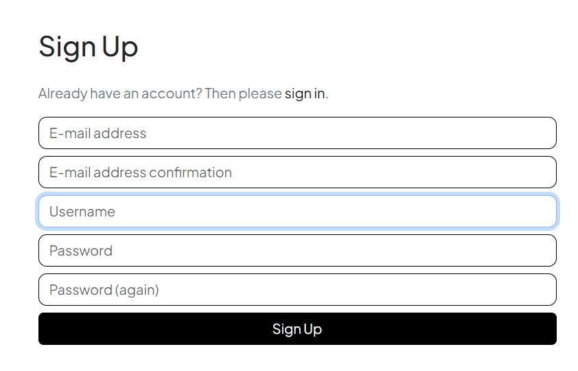|
| *"As a visitor I can navigate easily through the website using a header and footer so that I can have a seamless browsing experience"*||
| *"As a visitor I can navigate easily through the website using a header and footer so that I can have a seamless browsing experience"*||
| *"As a user I can see a home page with featured products, categories, comments and newsletter so that I can discover new and exciting items"*||
| *"As a registered user, I can log in to my account so that I can access my profile"*||
| *"As a logged-in user I can log out of my account so that I can end my session."*||
| *"As a registered user I can have a profile page with sections for personal information, order history, and a favorites list so that I can manage my account effectively"*||
| *"As a registered user I can view my order history so that I can track and review my past purchases"*||
| *"As a registered user I can maintain a list of favorite products so that I can easily access and track items I'm interested in"*|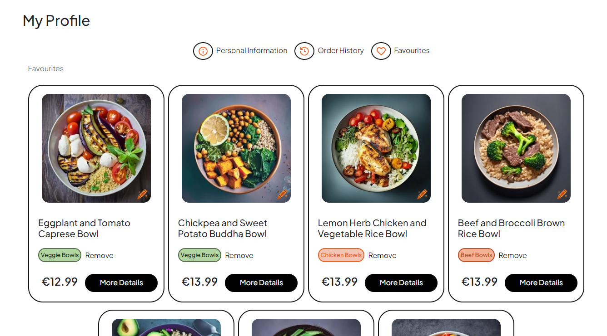|
| *"As a registered user I can update my personal information on my profile so that my account details are always accurate"*||
| *"As a user I can fill out the contact form and send a message so that I can communicate with the site administrators"*||
| *"As a user I can subscribe to the newsletter so that I can receive updates and promotions"*||
| *"As a user I can leave comments under a certain product so that I can share my thoughts about a particular products"*|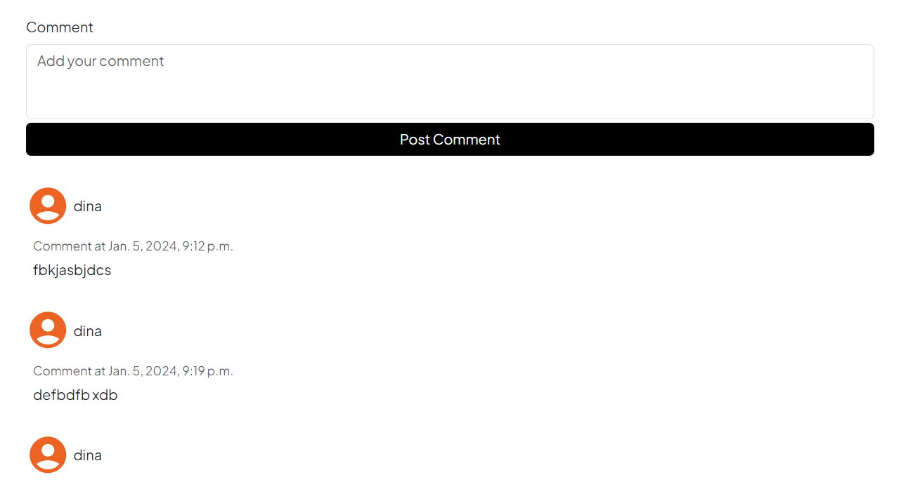|
| *"As a user I can access and review the privacy policy of the website so that I can understand how my personal information is handled"*||
| *"As a shopper I can search for a product by name or description easily so that I can find specific items quickly"*||
| *"As a shopper I can view a list of products and product details so that I can make a purchase"*|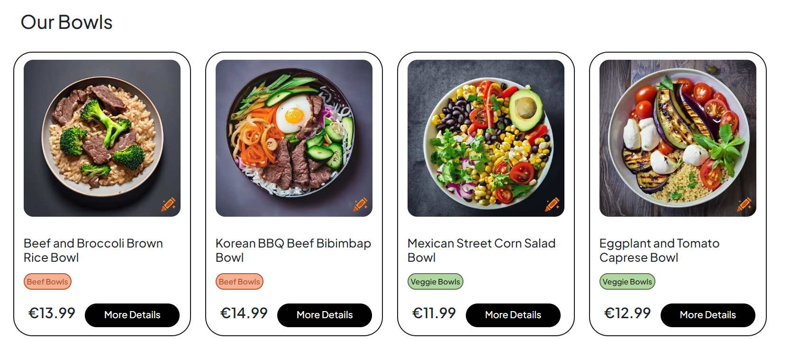|
| *"As a shopper I can view a list of products and product details so that I can make a purchase"*|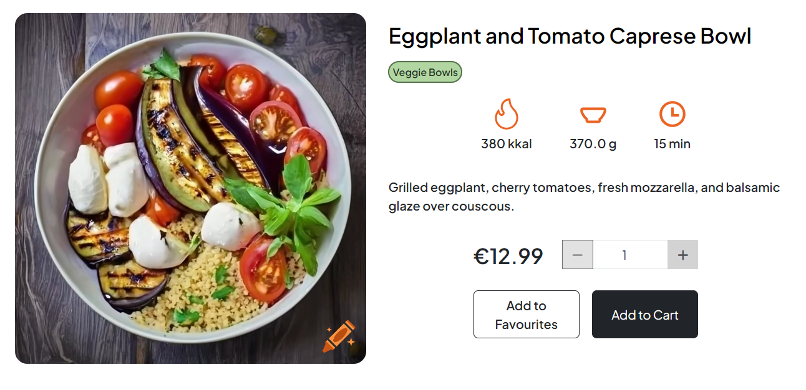|
| *"As a shopper I can view product categories so that I can explore items based on my preferences"*|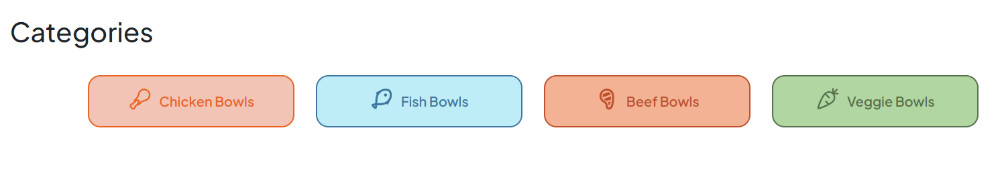|
| *"As a shopper I can easily select the quantity of a product when purchasing it so that I can control my order details"*||
| *"As a shopper, I can add items to cart, view items in my cart and adjust the quantity before checkout so that I can review and modify my order"*||
| *"As a shopper I can see the total price for the items and enter payment information securely during checkout so that I can make a purchase"*|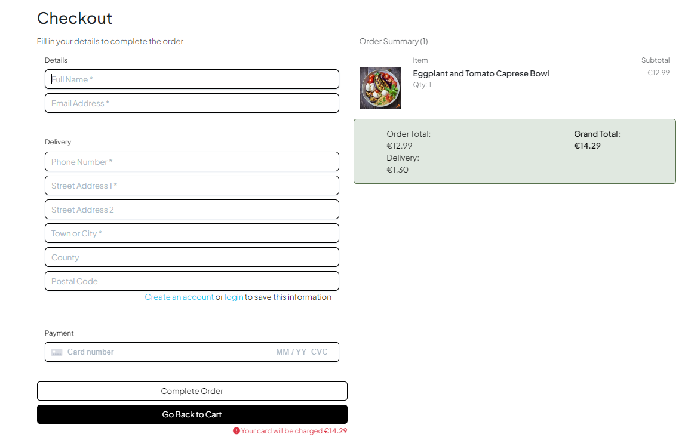|
| *"As a shopper I can view an order confirmation after completing the checkout process so that I can have a summary of my purchase"*|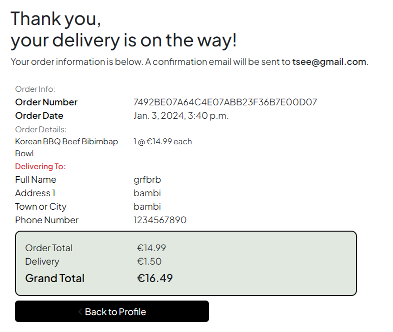|
| *"As a shopper I can receive an email confirmation after checking out so that I have a record of my purchase"*|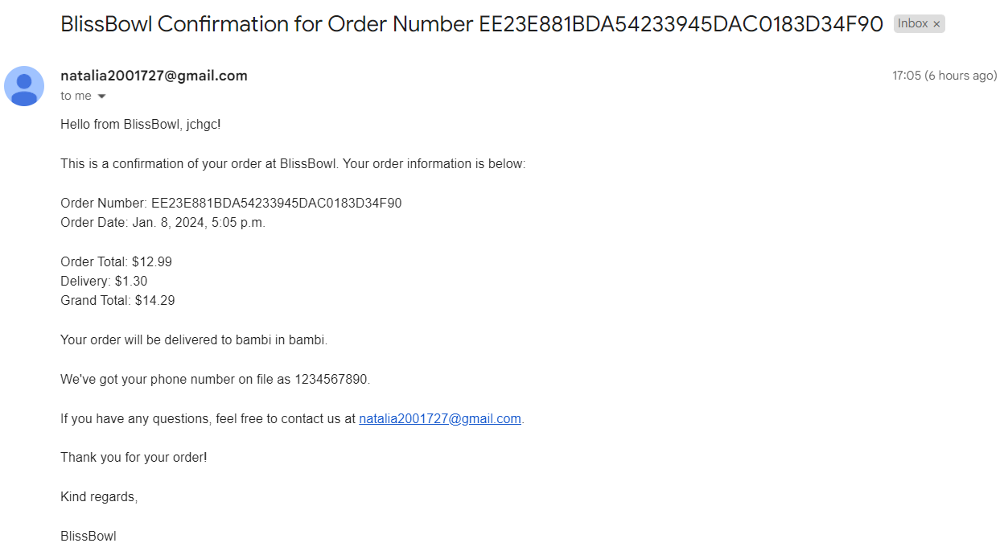|
| *"As a site admin I can add products to the catalog so that I can expand and update the product offerings"*||
| *"As a site admin I can edit/update existing products on the webiste so that I can keep product information accurate"*||
| *"As a site admin I can delete products from the catalog so that I can manage the product offerings effectively"*||
| *"As a site admin I can make the website SEO-optimized so that it ranks higher in search engine results"*||
| *"As a site admin I can make the website SEO-optimized so that it ranks higher in search engine results"*||
| *"As a site admin I can make the website SEO-optimized so that it ranks higher in search engine results"*|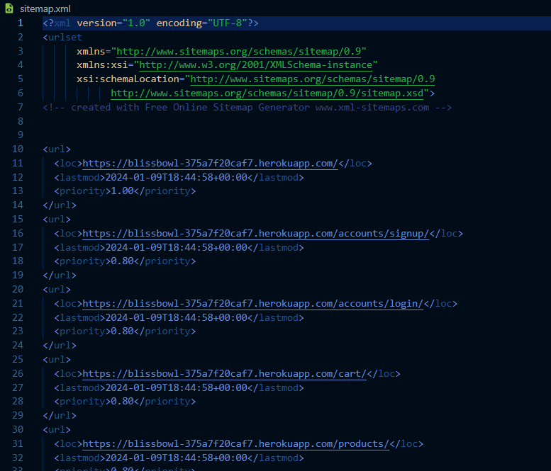|
| *"As a site admin I can implement Facebook marketing strategies so that the website gains visibility and attracts more users"*||

## Validator Testing

### HTML

[W3C validation](https://validator.w3.org/) was used to check the markup validity of html file.

<details><summary><b>base (index).html</b></summary>


</details>

<details><summary><b>products.html</b></summary>


</details>

<details><summary><b>product_detail.html</b></summary>


</details>

<details><summary><b>add_product.html</b></summary>


</details>

<details><summary><b>edit_product.html</b></summary>


</details>

<details><summary><b>cart.html</b></summary>


</details>

<details><summary><b>checkout.html</b></summary>


</details>

<details><summary><b>checkout_success.html</b></summary>


</details>

<details><summary><b>contact.html</b></summary>


</details>

<details><summary><b>profile.html</b></summary>


</details>

### CSS

[Jigsaw](https://jigsaw.w3.org/css-validator/) was used to check the validity of css file.

<details><summary><b>base.css</b></summary>


</details>

<details><summary><b>checkout.html</b></summary>

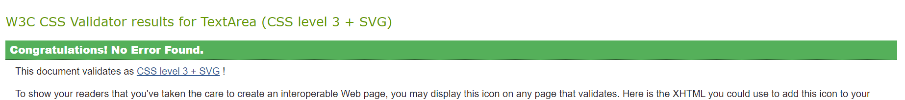
</details>

<details><summary><b>profile.css</b></summary>


</details>

### JavaScript

[JSHint](https://jshint.com/) was used for validation.

<details><summary><b>stripe_elements.js</b></summary>


</details>

<details><summary><b>quantity_input_script</b></summary>


</details>

<details><summary><b>Other js code in html</b></summary>


</details>

### Python

[CI Python Linter](https://pep8ci.herokuapp.com/) was used to check the validity of python files.

* BlissBowl project

<details><summary><b>views.py</b></summary>


</details>

<details><summary><b>urls.py</b></summary>


</details>

* Cart app

<details><summary><b>views.py</b></summary>


</details>

<details><summary><b>urls.py</b></summary>


</details>

<details><summary><b>contexts.py</b></summary>


</details>

* Checkout app

<details><summary><b>views.py</b></summary>


</details>

<details><summary><b>urls.py</b></summary>


</details>

<details><summary><b>models.py</b></summary>


</details>

<details><summary><b>forms.py</b></summary>


</details>

<details><summary><b>signals.py</b></summary>


</details>

<details><summary><b>admin.py</b></summary>


</details>

<details><summary><b>webhooks.py</b></summary>


</details>

* Contact app

<details><summary><b>views.py</b></summary>


</details>

<details><summary><b>urls.py</b></summary>

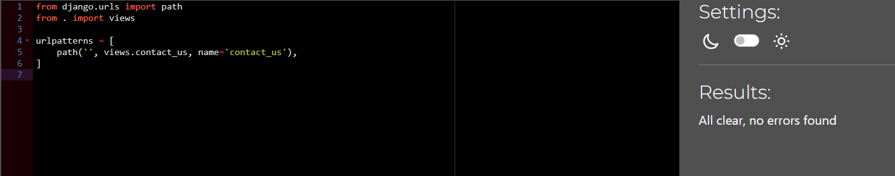
</details>

<details><summary><b>models.py</b></summary>


</details>

<details><summary><b>forms.py</b></summary>


</details>

<details><summary><b>admin.py</b></summary>


</details>

* Homepage app

<details><summary><b>views.py</b></summary>


</details>

<details><summary><b>urls.py</b></summary>


</details>

* Newsletter app

<details><summary><b>views.py</b></summary>


</details>

<details><summary><b>urls.py</b></summary>


</details>

<details><summary><b>models.py</b></summary>


</details>

<details><summary><b>forms.py</b></summary>


</details>

<details><summary><b>admin.py</b></summary>


</details>

* Products app

<details><summary><b>views.py</b></summary>


</details>

<details><summary><b>models.py</b></summary>


</details>

<details><summary><b>forms.py</b></summary>


</details>

<details><summary><b>admin.py</b></summary>


</details>

<details><summary><b>widgets.py</b></summary>


</details>

* Profiles app

<details><summary><b>views.py</b></summary>


</details>

<details><summary><b>models.py</b></summary>


</details>

<details><summary><b>forms.py</b></summary>


</details>

<details><summary><b>admin.py</b></summary>


</details>

## Unit Testing

### Coverage

In order to run the tests, I ran the following command in the terminal each time:

`python3 manage.py test `

To create the coverage report, I would then run the following commands:

`coverage run manage.py test`

`coverage report`

To see the HTML version of the reports, and find out whether some pieces of code were missing, I ran the following commands:

`coverage html`

`python3 -m http.server`

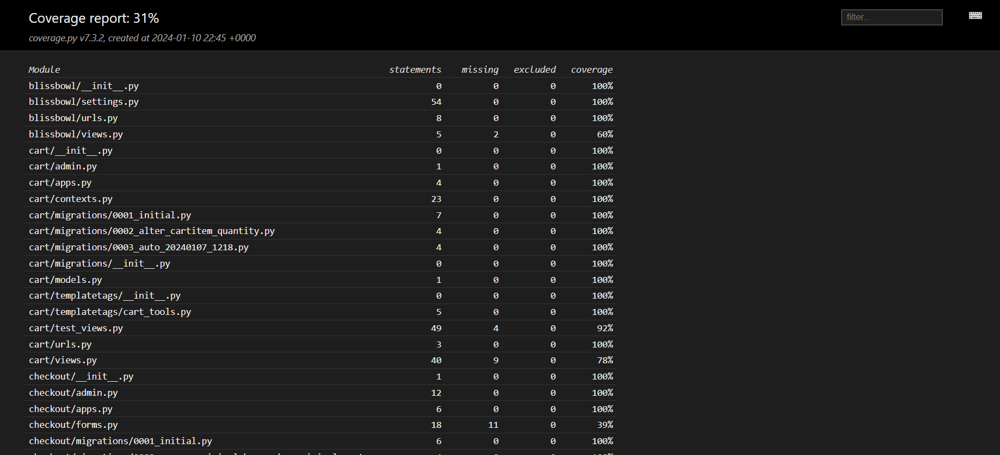

Because of time constraints, I managed to create only six test files.

Tests were created for the following files:

* test_views.py (cart)


* test_models.py (contact)


* test_views.py (contact)


* test_views.py (homepage)


* test_forms.py (newsletter)


* test_models.py (newsletter)


### Error Pages Testing

#### 404.html

I entered a non-existent url to make sure the 404 page appeared.


#### 500.html

I created a test view with url to test 500 page.


## Manual Testing

| Page | User Action | Expected Result | Pass/Fail | Comments |
| --- | --- | --- | --- | --- |
| **Home Page and Navbar** | | | | |
| | Click on Logo | Redirection to Home page | Pass | |
| | Click on Home button in navbar | Redirection to Home page | Pass | |
| | Click on Chicken Bowls button in navbar | Redirection to Products page (Chicken) | Pass | |
| | Click on Fish Bowls button in navbar | Redirection to Products page (Fish) | Pass | |
| | Click on Beef Bowls button in navbar | Redirection to Products page (Beef) | Pass | |
| | Click on Veggie Bowls button in navbar | Redirection to Products page (Veggie) | Pass | |
| | Click on My Profile button in navbar | Redirection to Profile page | Pass | |
| | Click on Log Out button in navbar | Redirection to Log out page | Pass | |
| | Click on Product Management Bowls button in navbar | Redirection to Add Product page | Pass | |
| | Click on Sign Up Bowls button in navbar | Redirection to Sign Up page | Pass | |
| | Click on Sign In Bowls button in navbar | Redirection to Sign In page | Pass | |
| | Click on Shopping cart icon button in navbar | Redirection to Cart page | Pass | |
| | Click on Chicken Bowls button in Categories section | Redirection to Products page (Chicken) | Pass | |
| | Click on Fish Bowls button in Categories section | Redirection to Products page (Fish) | Pass | |
| | Click on Beef Bowls button in Categories section | Redirection to Products page (Beef) | Pass | |
| | Click on Veggie Bowls button in Categories section | Redirection to Products page (Veggie) | Pass | |
| | Click on Order Now button in Free delivery section | Redirection to Products page | Pass | |
| **Footer** | | | | |
| | Click Home link in footer | Redirects user to Home page | Pass | |
| | Click Contact Us link in footer | Redirects user to contact page | Pass | |
| | Click social media icons in footer | Opens social media site clicked in a new tab | Pass | |
| | Click on Products in footer | Redirection to Products page | Pass | |
| | Click on Privacy Policy in footer | Redirection to Privacy Policy page that opens in the new tab | Pass | |
| | Click on Subscribe button on blank newsletter form | Error message appears telling user to fill in this field | Pass | |
| | Click on Subscribe button on filled newsletter form | Alert message lets user know they have signed up for the mailing list and welcome email is sent to address provided | Pass | |
| | Try to subscribe to newsletter with already subscribed email address | Error message appears telling user to check the form or make sure they're not already subscribed | Pass/Fail | The functionality is working but the message is not appearing |
| **Products Page** | | | | |
| | Click on Chicken Bowls button in Categories section | Filters products and shows chicken bowls | Pass | |
| | Click on Fish Bowls button in Categories section | Filters products and shows fish bowls | Pass | |
| | Click on Beef Bowls button in Categories section | Filters products and shows beef bowls | Pass | |
| | Click on Veggie Bowls button in Categories section | Filters products and shows veggie bowls | Pass | |
| | Click on More Details button | Redirects to Product Detail page to | Pass | |
| | Click on edit product button | Redirection to Edit Product page for that product | Pass | Button only appears if logged in user is an admin |
| | Click on delete product button | Deletes Product | Pass | Delete modal should have been added |
| **Product Detail Page** | | | | |
| | Click on Add To Favourites button if the user is not authenticated | Redirection to Sign In page | Pass | |
| | Click on Add To Favourites button if the user is authenticated | Redirection to Profile page and add product to favourites | Pass | |
| | Click on Add To Favourites button if the product is already in Favourites | Displays message that the bowl is already in favourites | Pass/Fail | It doesn't add it to favourites again and redirects to Profile but the message is not displayed |
| | Click + button on quantity selector form | Quantity number increases to 10 | Pass | |
| | Click - button on quantity selector form | Quantity number decreases to one | Pass | |
| | Click on Categories button | Redirects to Products page and shows products from that category | Pass | |
| | Manually enter number greater than 10 | Error message appears letting the user know what the value must be | Pass | |
| | Click Add To Cart button | Product is added to cart and quantity is set to the user's choice | Pass | |
| | Click Add To Cart button when user already has the product in their basket | Quantity selected is added to the existing quantity in the user's cart for the product | Pass | |
| | Click on edit product button | Redirection to Edit Product page for that product | Pass | Button only appears if logged in user is an admin |
| | Click on delete product button | Deletes Product | Pass | Delete modal should have been added |
| | Add comment under the product if the user is not authenticated | Ask user to sign in | Pass | |
| | Add comment under the product if the user is authenticated | Add comment | Pass | |
| **Search** | | | | |
| | Enter word into search bar that appears in at least one product's name or description | Redirection to Products page | Pass | Products filtered to only show products containing search term |
| | Enter word into search bar that doesn't appear in any product's name or description | Redirection to Products page | Pass | Products page is empty and shows user that 0 products were returned |
| | Enter nothing into search bar | Redirection to Products page | Pass | Error message shows and lets user know they didn't enter any search criteria |
| **Contact Page** | | | | |
| | Enter name | Form will only submit if all fields are filled | Pass | |
| | Enter valid email address | Field will only accept email address format | Pass | |
| | Enter message | Form will only submit if all fields are filled | Pass | |
| | Click Send with missing fields | Message lets user know all fields are required | Pass | |
| | Click Send with all valid fields | User is sent email confirming their message has been received and information has been saved in the database | Pass | |
| **Sign Up Page** | | | | |
| | Enter valid email address | Field will only accept email address format | Pass | |
| | Enter valid password (twice) | Field will only accept password format | Pass | |
| | Click Sign Up button on sign up page | Sends confirmation email and lets user know to check their email | Pass | |
| | Click link in confirmation email | Redirects user to sign in page | Pass | |
| **Sign In Page** | | | | |
| | Enter valid email address | Field will only accept email address format | Pass | |
| | Enter valid password | Field will only accept password format | Pass | |
| | Click Login button on login page | Redirects user to homepage | Pass | |
| **Log Out Page** | | | | |
| | Click Logout button | Redirects user to logout and asks for confirmation that the user wants to log out page | Pass | |
| | Click Logout button | Redirects user to home page | Pass | |
| **User Profile Page** | | | | |
| | Click Update Information button | Saves form contents to be default information for user | Pass | Default information is cleared if form is submitted while blank |
| | Click Order History to see previous orders in Order History | Redirects user to order history section | Pass | |
| | Click Order Number for previous order in Order History | Redirects user to order confirmation page for that order | Pass | |
| | Click Favourites to see favourite bowls | Redirects user to favourites section | Pass | |
| | Click Remove in Favourites to remove a bowl | Removes a bowl Redirects user to main profile section | Pass | Should've implemented a functionality to redirect to favourites section |
| **Cart** | | | | |
| | Click Add to Cart button | Pop-up window with the items in order appears| Pass | |
| | Click Go to Checkout button | Redirects to cart | Pass | |
| | Click - button on quantity selector form | Quantity number decreases if current quantity is greater than one | Pass | |
| | Click + button on quantity selector | Quantity number increases to 10 | Pass | |
| | Click update button under quantity selector form | Updated quantity of product in cart to number in quantity select form | Pass | |
| | Click remove button under quantity selector form | Removes product from cart | Pass | |
| | Click on Back to Products button | Redirection to All Products page | Pass | |
| | Click on Go to Checkout button | Redirection to checkout page | Pass | |
| **Checkout** | | | | |
| | Click Complete Order button without all required fields filled out | Brings back to the form | Pass | |
| | Click Save delivery information to profile button | User's default information will be saved and displayed at the checkout on order completion | Pass | Only visible to logged in users |
| | Click on Create an account link | Redirection to sign up page | Pass | Only visible to logged out users |
| | Click on login link | Redirection to sign in page | Pass | Only visible to logged out users |
| | Click Complete Order button without card details filled out | Message letting user know that their card number is incomplete | Pass | |
| | Click Complete Order button with all details filled out | Loading spinner appears and order is processed | Pass | |
| | Order completed | Order confirmation email is sent to the user and redirection to checkout success page | Pass | |
| **Checkout Success Page** | | | | |
| | Click Back to Products button | Redirects user to products page | Pass | |
| | Click Back to profile button button | Redirects user to their profile | Pass | Only visible if user comes to this page from the order history list on their profile |
| **Add Product Page** | | | | |
| | Click Product Management link from Admin dropdown | Redirects admin to add product page | Pass | User can only see this if they're logged in as an admin |
| | Click Cancel button | Redirects admin to products page | Pass | |
| | Click Add Product button with form filled correctly | Creates a new product on the site using the information provided | Pass | The only issue is that max length for price is 8 symbols instead of 4 |
| | Click Add Product button with form filled incorrectly | Message appears letting the admin know to fill in the required form fields | Pass | |
| | Click Add Product button with no image set | Product will be created but will be displayed with default product image | Pass | |
| **Edit Product Page** | | | | |
| | Click edit icon on product | Redirects user to Edit Product page | Pass | User must be an admin to see icon and access this page |
| | Click Cancel button | Redirects admin to all products page | Pass | |
| | Click Update Product button with form filled correctly | Updates product with information provided | Pass | |
| | Click Update Product button with form filled incorrectly | Message appears letting the admin know to fill in the required form fields | Pass | |
| | Click Update Product button with no image set | Product will be updated but will be displayed with default product image | Pass | |

### Lighthouse

Note to the assessors: The accessibility is low because of some of the Bootstrap elements.

##### Mobile

| Page | Screenshot |
| ---  | --- |
| Home |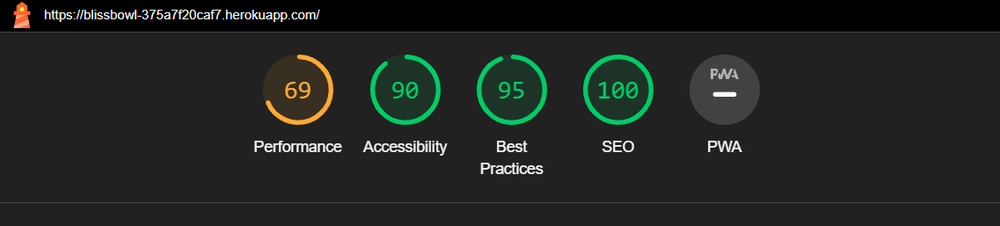 |
| Products |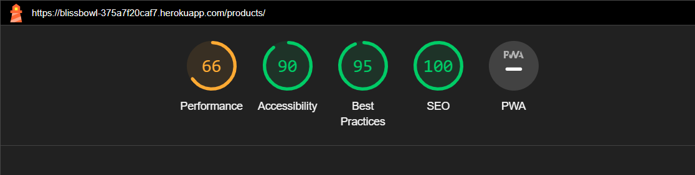 |
| Product Detail |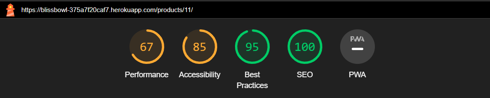 |
| Cart | |
| Checkout |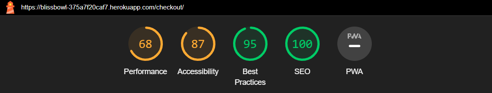 |
| Checkout Success |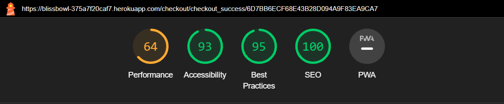 |
| Profile |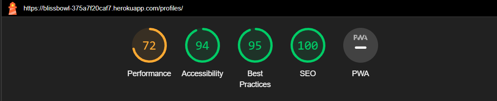 |
| Contact | |
| Add Product |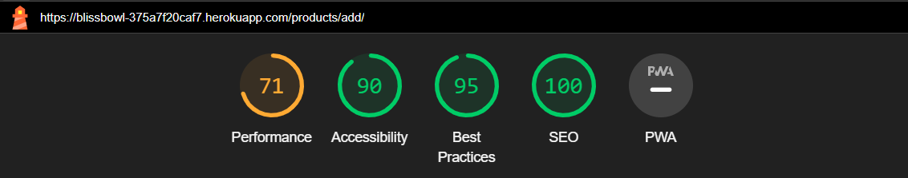 |
| Edit Product | |
| Sign Up | |
| Sign In | |
| Log Out | |

##### Desktop

| Page | Screenshot |
| ---  | --- |
| Home |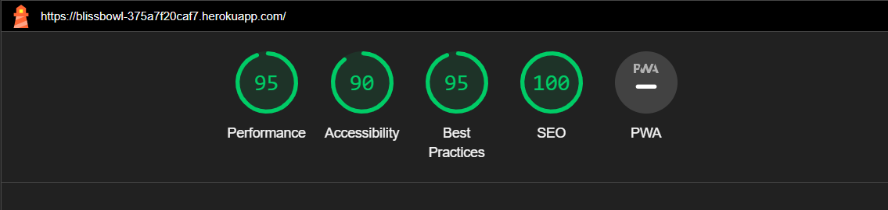 |
| Products | |
| Product Detail | |
| Cart | |
| Checkout |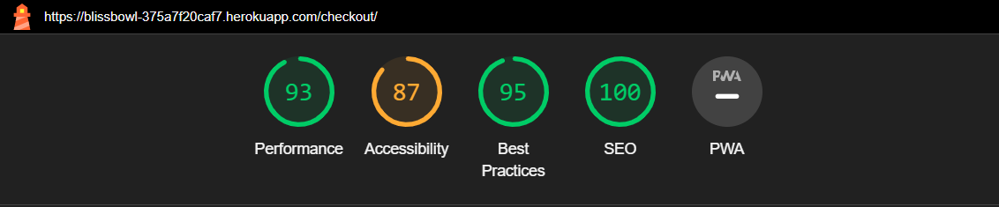 |
| Checkout Success |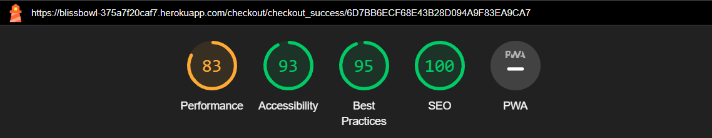 |
| Profile |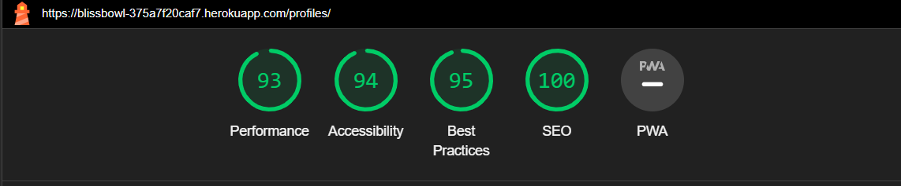 |
| Contact | |
| Add Product | |
| Edit Product |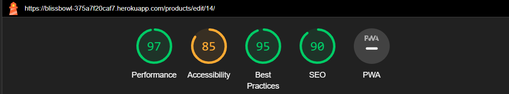 |
| Sign Up |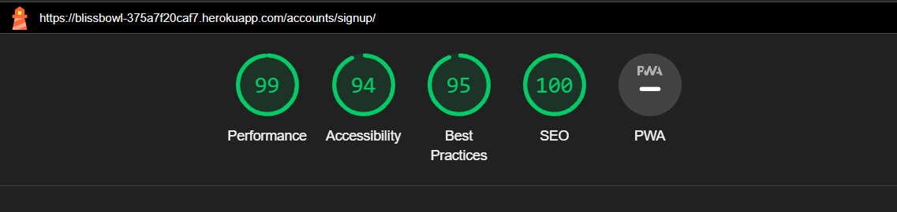 |
| Sign In | |
| Log Out |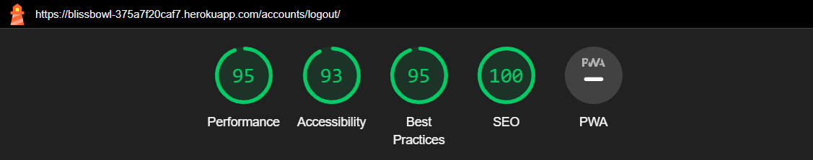 |

### Responsiveness

Responsiveness is tested on various devices such as:

<details><summary><b>Samsung Galaxy S8+</b></summary>


</details>

<details><summary><b>Samsung Galaxy A34</b></summary>


</details>

<details><summary><b>Moto G Power</b></summary>


</details>

<details><summary><b>IPad</b></summary>


</details>

### Browser compatibility

| Browser | Fail/Pass | Screenshot |
| ---  | ---  | --- |
| Chrome | Pass |  |
| Edge | Pass |  |
| Opera | Pass | 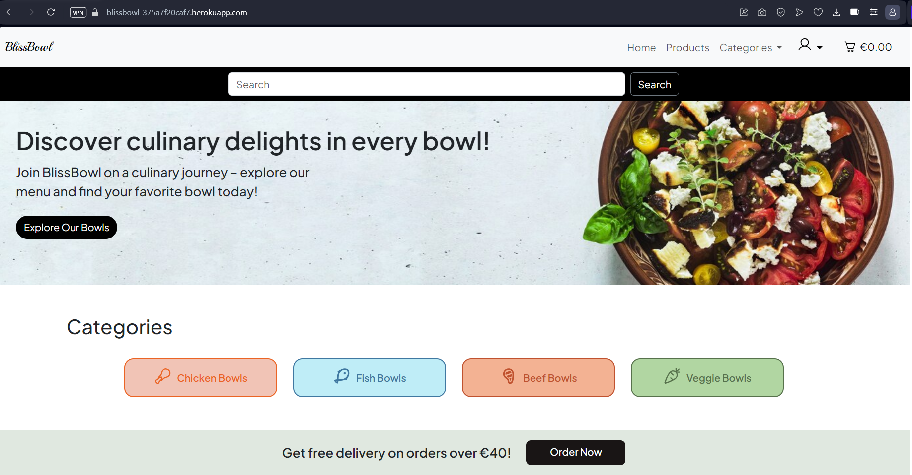 |
| Firefox | Pass |  |

## Bugs

### Solved

* There is a problem with Stripe webhook, one of the events keeps failing everytime the order was going through and the order confirmation email wasn't sending as well, so I decided to move send_confirmation_email function into a checkout_success view and it worked.

```python
def checkout_success(request, order_number):
    """
    Handle successful checkouts
    """

    save_info = request.session.get('save_info')
    order = get_object_or_404(Order, order_number=order_number)

    if request.user.is_authenticated:
        profile = UserProfile.objects.get(user=request.user)
        # Attach the user's profile to the order
        order.user_profile = profile
        order.save()

        # Save the user's info
        if save_info:
            profile_data = {
                'default_phone_number': order.phone_number,
                'default_postcode': order.postcode,
                'default_town_or_city': order.town_or_city,
                'default_street_address1': order.street_address1,
                'default_street_address2': order.street_address2,
                'default_county': order.county,
            }
            user_profile_form = UserProfileForm(profile_data, instance=profile)
            if user_profile_form.is_valid():
                user_profile_form.save()

    # Send confirmation email
    send_confirmation_email(order)

    messages.success(
        request, f'Order successfully processed! Your order number is {order_number}. A confirmation email has been sent to {order.email}.')

    if 'cart' in request.session:
        del request.session['cart']

    template = 'checkout/checkout_success.html'
    context = {
        'order': order,
    }

    return render(request, template, context)


def send_confirmation_email(order):
    """Send the user a confirmation email"""
    cust_email = order.email

    # Remove newline characters from the subject
    subject = render_to_string(
        'checkout/confirmation_emails/confirmation_email_subject.txt', {'order': order}).strip()

    body = render_to_string('checkout/confirmation_emails/confirmation_email_body.txt', {
                            'order': order, 'contact_email': settings.DEFAULT_FROM_EMAIL})

    send_mail(
        subject,
        body,
        settings.DEFAULT_FROM_EMAIL,
        [cust_email]
    )

```
* Stripe js error

I've been having a stripe js error on my profile page and I fixed that by removing the unnecessary stripe block at the end of the html file.


### Unsolved

* As I still have a problem with Stripe webhook, the ```payment_intent.succeeded``` keeps failing. I talked about this with one of the tutors but she said that the code is correct and it should be working. Below is one the screenshot:

 

* Newsletter messages

The overall newsletter is working but the message for when the user is already signed up for a newsletter is not showing up. The functionality for when the user is already sign up is still working and the user email is not saving to the database if it's already there.

* When you copy the url for add/edit product and the user is not logged in, it redirects you to the sign in page as it supposed to but when you log in as a user and not an admin instead of showing the message that
"Only store owners can do that" it shows this and then after you refresh it shows home page and a message. My views for this functionality seems to be correct, so I don't know what could be causing this.

 

* Also, in my project I have two media folders because the first time when the media folder was in root directory, the images weren't displaying on the page, so I've decided to move it into static folder and it worked for me. Then, when I have connected Cloudinary, the media folder with all the images was created again in root directory. Due to the shortage of time, I am not able to fix this issue now.

