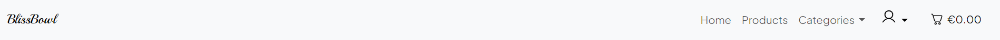
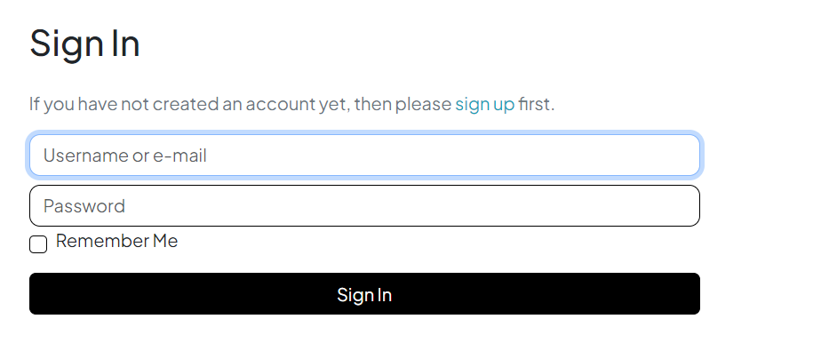
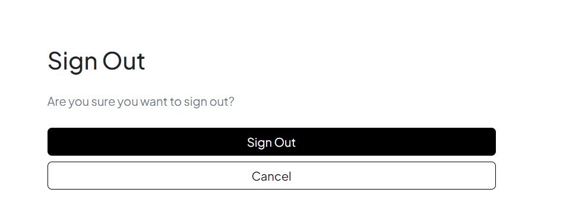
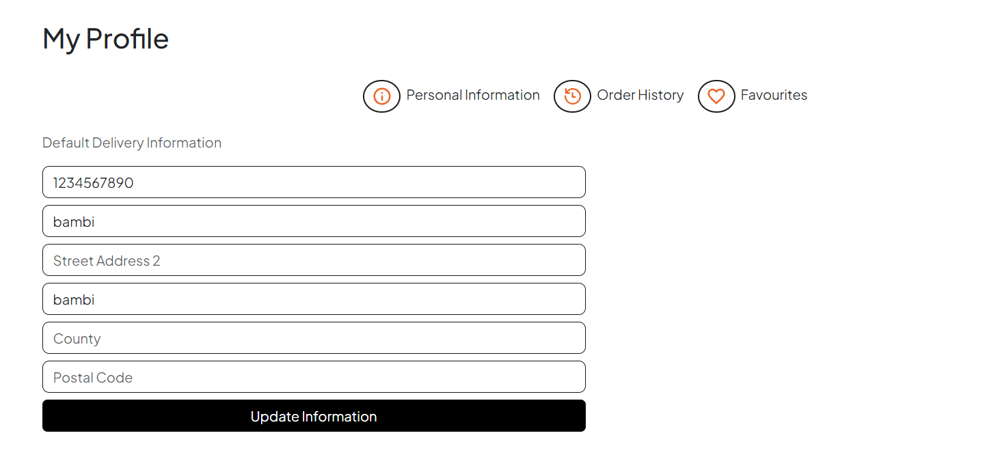
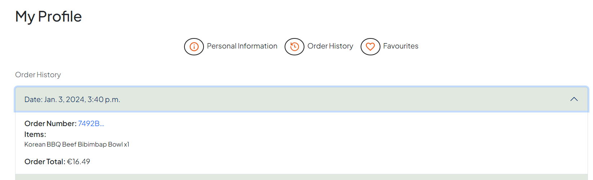
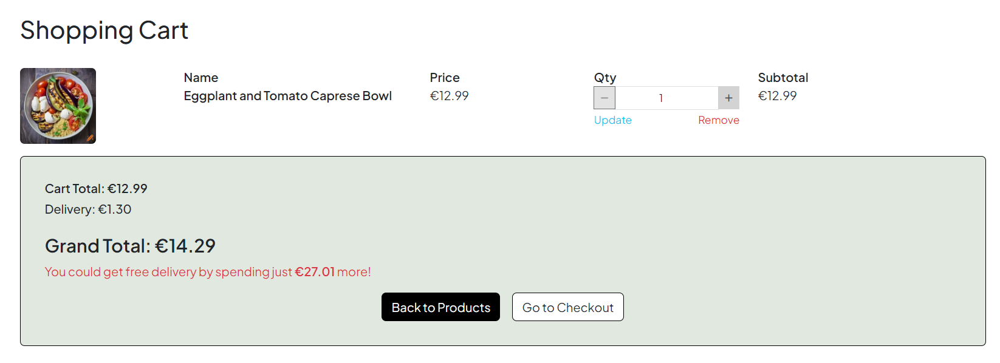
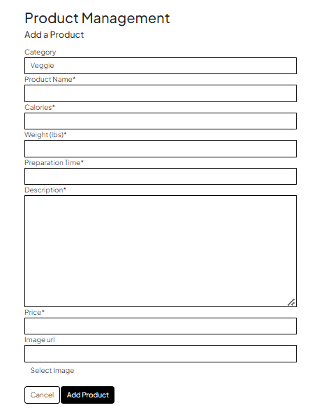
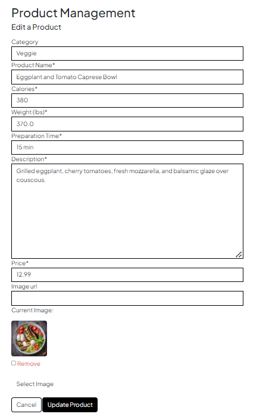
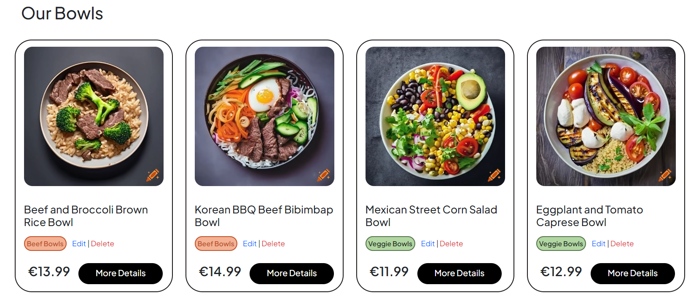
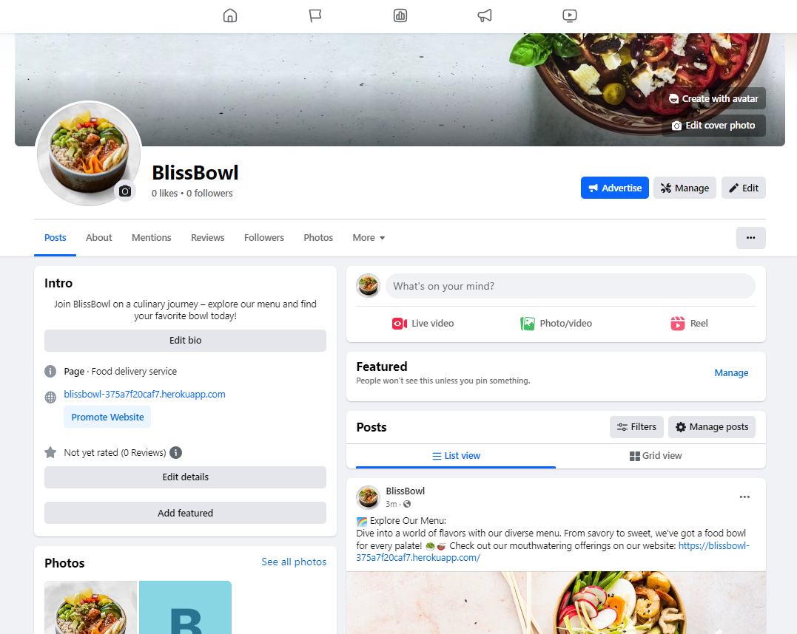

# BlissBowl Website

Back to [README](README.md)

## Testing Overview

## Table of Contents

- [User Story Tests](#user-story-tests)
- [Validator Testing](#validator-testing)
    - [HTML](#html)
    - [CSS](#css)
    - [JS](#javascript)
    - [Python](#python)
- [Unit Testing](#unit-testing)
    - [Coverage](#coverage)
- [Error Handling](#error-handling)
- [Manual Testing](#manual-testing)
- [Lighthouse](#lighthouse)
- [Responsiveness](#responsiveness)
- [Browser compatibility](#browser-compatibility)
- [Bugs](#bugs)
    - [Solved](#solved)
    - [Unsolved](#unsolved)

## User Story Tests

| User Story | Screenshot |
| --- | --- |
| *"As a visitor, I can sign up for an account so that I can access personalized features"*||
| *"As a visitor I can navigate easily through the website using a header and footer so that I can have a seamless browsing experience"*||
| *"As a visitor I can navigate easily through the website using a header and footer so that I can have a seamless browsing experience"*||
| *"As a user I can see a home page with featured products, categories, comments and newsletter so that I can discover new and exciting items"*||
| *"As a registered user, I can log in to my account so that I can access my profile"*||
| *"As a logged-in user I can log out of my account so that I can end my session."*||
| *"As a registered user I can have a profile page with sections for personal information, order history, and a favorites list so that I can manage my account effectively"*||
| *"As a registered user I can view my order history so that I can track and review my past purchases"*||
| *"As a registered user I can maintain a list of favorite products so that I can easily access and track items I'm interested in"*||
| *"As a registered user I can update my personal information on my profile so that my account details are always accurate"*||
| *"As a user I can fill out the contact form and send a message so that I can communicate with the site administrators"*||
| *"As a user I can subscribe to the newsletter so that I can receive updates and promotions"*||
| *"As a user I can leave comments under a certain product so that I can share my thoughts about a particular products"*||
| *"As a user I can access and review the privacy policy of the website so that I can understand how my personal information is handled"*||
| *"As a shopper I can search for a product by name or description easily so that I can find specific items quickly"*||
| *"As a shopper I can view a list of products and product details so that I can make a purchase"*||
| *"As a shopper I can view a list of products and product details so that I can make a purchase"*||
| *"As a shopper I can view product categories so that I can explore items based on my preferences"*||
| *"As a shopper I can easily select the quantity of a product when purchasing it so that I can control my order details"*||
| *"As a shopper, I can add items to cart, view items in my cart and adjust the quantity before checkout so that I can review and modify my order"*||
| *"As a shopper I can see the total price for the items and enter payment information securely during checkout so that I can make a purchase"*||
| *"As a shopper I can view an order confirmation after completing the checkout process so that I can have a summary of my purchase"*||
| *"As a shopper I can receive an email confirmation after checking out so that I have a record of my purchase"*||
| *"As a site admin I can add products to the catalog so that I can expand and update the product offerings"*||
| *"As a site admin I can edit/update existing products on the webiste so that I can keep product information accurate"*||
| *"As a site admin I can delete products from the catalog so that I can manage the product offerings effectively"*||
| *"As a site admin I can make the website SEO-optimized so that it ranks higher in search engine results"*||
| *"As a site admin I can implement Facebook marketing strategies so that the website gains visibility and attracts more users"*||

## Validator Testing

### HTML

[W3C validation](https://validator.w3.org/) was used to check the markup validity of html file.

### CSS

[Jigsaw](https://jigsaw.w3.org/css-validator/) was used to check the validity of css file.

### JavaScript

[JSHint](https://jshint.com/) was used for validation.

### Python

[CI Python Linter](https://pep8ci.herokuapp.com/) was used to check the validity of python files.

## Unit Testing

### Coverage

In order to run the tests, I ran the following command in the terminal each time:

`python3 manage.py test name-of-app `

To create the coverage report, I would then run the following commands:

`coverage run --source=name-of-app manage.py test`

`coverage report`

To see the HTML version of the reports, and find out whether some pieces of code were missing, I ran the following commands:

`coverage html`

`python3 -m http.server`

####  app

## Error Handling

### Error Pages Testing

## Manual Testing

### Accessibility

### Lighthouse

##### Mobile

| Page | Size | Screenshot |
| ---  | ---  | --- |

##### Desktop

| Page | Size | Screenshot |
| ---  | ---  | --- |

### Responsiveness

### Browser compatibility

| Browser | Fail/Pass | Screenshot |
| ---  | ---  | --- |

## Bugs

### Solved

### Unsolved

